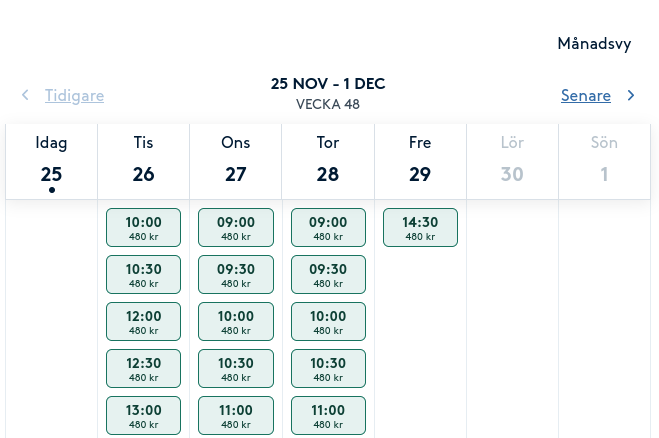

# Bokadirekt-watcher

A script that finds newly added time slots for a service at [Bokadirekt](https://www.bokadirekt.se). Useful if the next barber appointment is 2 months away, but you know the barber sometimes gets cancellations and those time slots are released again.

It will go to a time booking page on [Bokadirekt](https://www.bokadirekt.se) and look for the first available time slot, and send an email if the time slot has not been seen before.



## Install dependencies

```bash
python3 -m venv venv
source venv/bin/activate
pip install -r requirements.txt
```

## Configure

```bash
cp config.yaml.dist config.yaml
# modify config.yaml with your settings
```

## Run

```bash
cd ~/testarea/bokadirekt-watcher
source venv/bin/activate
python3 bokadirekt.py -c config.yaml
```

## Setup crontab
Use crontab to run the script periodically.

```bash
0 * * * * bash ~/testarea/bokadirekt-watcher/crontab_runner.sh
```


